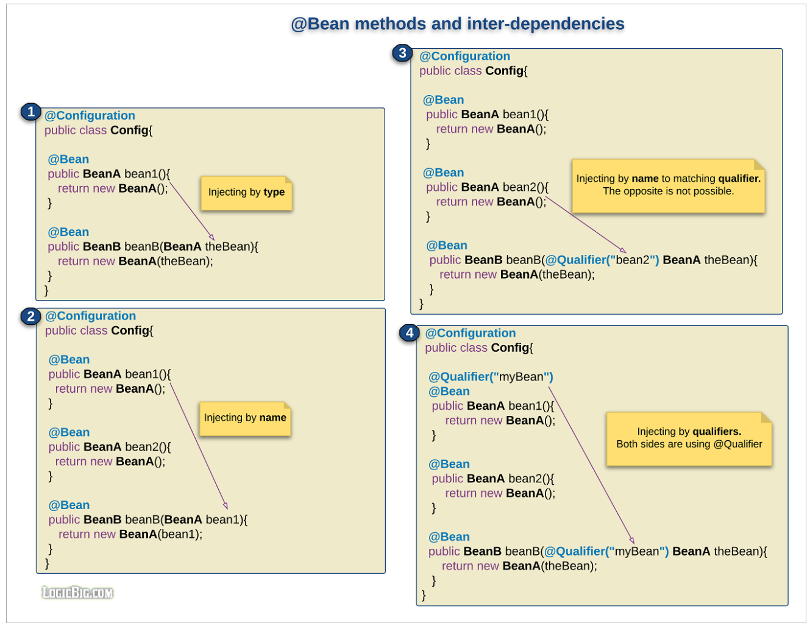
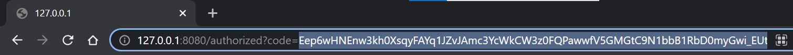
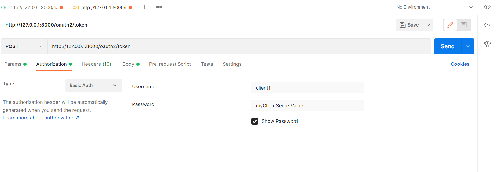
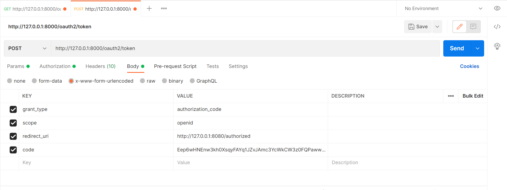

# Spring Authorization Server using OAuth Authorization Code Flow Grant Type (Confidential Client)

* Get authorization `code` 
  * copy, paste and hit the url in browser window. It will display login screen
  * enter username `sergey` and password `password`
  
  * copy authorization `code` after authentication from browser address bar
  

```http request
http://127.0.0.1:8000/oauth2/authorize?response_type=code&client_id=client1&redirect_uri=http://127.0.0.1:8080/authorized&scope=openid read
```

* Get `access_token`
  * Go to POSTMAN -> AUTHORIZATION -> Type: Basic Auth -> Username: `client1`, Password: `myClientSecretValue`
  * Username and Password is basically client_id and client_secret respectively for Basic Auth
  
  * Send POST request to `http://127.0.0.1:8000/oauth2/token` using following parameters
  
  * for `code` paste the `code` that we have copied from previous step
  
